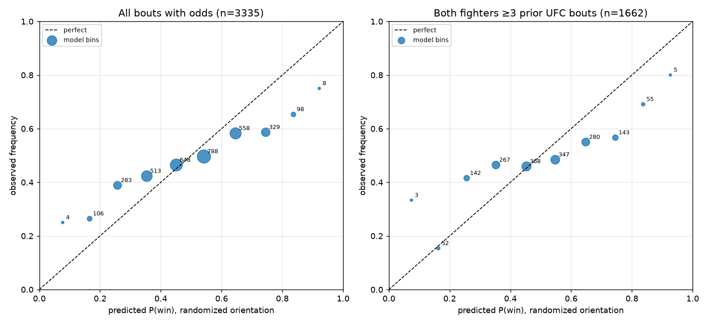

# Walk-forward backtest — tier1_glicko

Sample: **3335** decisive UFC bouts with matched odds (2014-11-07 → 2023-09-16); 22 draws/NCs excluded.

Strict walk-forward: every prediction was computed from ratings as they stood before the bout, in one chronological pass (leakage-tested).

## All bouts with odds (n=3335)

| metric | Tier 1 (Glicko-2) | implied prob (margin-removed) | pick favourite |
|---|---|---|---|
| log loss | 0.6985 | 0.6174 | – |
| Brier | 0.2510 | 0.2146 | – |
| accuracy | 56.4% | 65.0% | 65.1% |

Always-bet-favourite flat ROI: -1.2% (95% CI [-3.7%, +1.3%]).

**Tier 1 does NOT beat the bookmaker implied probability on log loss** in this subsample.

### Staking simulation (bet model-edge sides)

| edge > | bets | win% | flat ROI | flat 95% CI | 1/4-Kelly ROI | Kelly 95% CI |
|---|---|---|---|---|---|---|
| 0% | 3251 | 38.9% | -6.9% | [-11.5%, -2.3%] | -6.9% | [-12.4%, -1.4%] |
| 5% | 2952 | 37.5% | -6.6% | [-11.6%, -1.7%] | -7.0% | [-12.5%, -1.7%] |
| 10% | 2625 | 35.9% | -7.3% | [-12.5%, -1.9%] | -7.1% | [-12.8%, -1.2%] |

## Both fighters ≥3 prior UFC bouts (n=1662)

| metric | Tier 1 (Glicko-2) | implied prob (margin-removed) | pick favourite |
|---|---|---|---|
| log loss | 0.7017 | 0.6224 | – |
| Brier | 0.2529 | 0.2168 | – |
| accuracy | 55.1% | 64.8% | 64.9% |

Always-bet-favourite flat ROI: -0.7% (95% CI [-4.2%, +2.9%]).

**Tier 1 does NOT beat the bookmaker implied probability on log loss** in this subsample.

### Staking simulation (bet model-edge sides)

| edge > | bets | win% | flat ROI | flat 95% CI | 1/4-Kelly ROI | Kelly 95% CI |
|---|---|---|---|---|---|---|
| 0% | 1629 | 39.0% | -7.0% | [-13.4%, -0.6%] | -6.6% | [-13.9%, +1.0%] |
| 5% | 1482 | 37.8% | -6.6% | [-13.4%, +0.3%] | -6.7% | [-14.4%, +1.2%] |
| 10% | 1306 | 36.1% | -7.5% | [-14.6%, +0.5%] | -6.6% | [-14.3%, +1.8%] |

## Honest readout

- The bookmaker implied probability is a very strong predictor; Tier 1 uses results-level data only (no per-fight stats, no odds), so matching it is hard.
- A positive ROI whose 95% bootstrap CI includes 0 **is noise, not edge** — treat it as such. A few hundred bets is far too small a sample to claim an edge.
- CLV is N/A here: the historical dataset is a single closing-ish snapshot. Own open/close capture starts in build step 6.
- Tier 1 currently sees UFC bouts only; debutants enter at the prior (1500). Cross-promotion records (step 5) and Tier 2 stats (step 4) address this.
