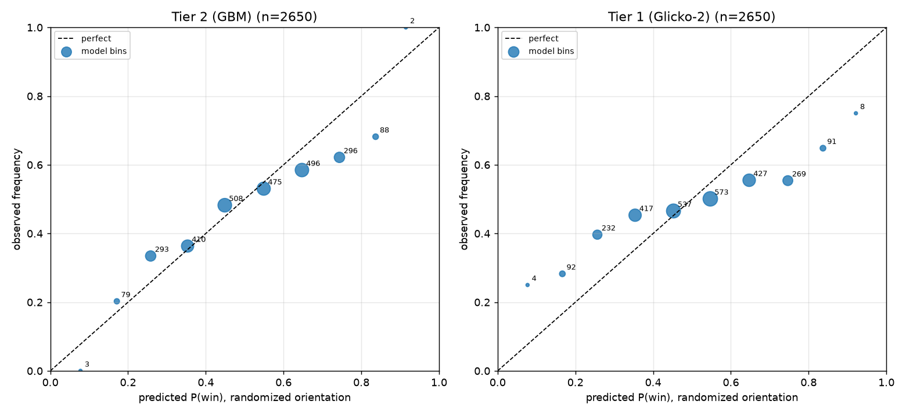

# Walk-forward backtest — model comparison

Common sample: **2650** decisive UFC bouts with odds and a prediction from every model (2014-11-07 → 2023-09-16).

| metric | Tier 2 (GBM) | Tier 1 (Glicko-2) | implied prob | pick favourite |
|---|---|---|---|---|
| log loss | 0.6762 | 0.7102 | 0.6269 | – |
| Brier | 0.2409 | 0.2563 | 0.2189 | – |
| accuracy | 59.4% | 55.1% | 63.9% | 64.0% |

Always-bet-favourite flat ROI on this sample: -2.1% (95% CI [-5.0%, +0.7%]).

## Tier 2 (GBM) — staking simulation

Tier 2 (GBM) **does NOT beat the bookmaker implied probability** on log loss.

| edge > | bets | win% | flat ROI | flat 95% CI | 1/4-Kelly ROI | Kelly 95% CI |
|---|---|---|---|---|---|---|
| 0% | 2580 | 43.8% | +0.6% | [-4.4%, +5.7%] | +4.9% | [-1.0%, +11.3%] |
| 5% | 2264 | 42.2% | +0.4% | [-5.1%, +5.8%] | +5.1% | [-1.2%, +11.6%] |
| 10% | 1949 | 40.8% | +1.5% | [-4.4%, +7.6%] | +5.4% | [-1.3%, +12.0%] |

## Tier 1 (Glicko-2) — staking simulation

Tier 1 (Glicko-2) **does NOT beat the bookmaker implied probability** on log loss.

| edge > | bets | win% | flat ROI | flat 95% CI | 1/4-Kelly ROI | Kelly 95% CI |
|---|---|---|---|---|---|---|
| 0% | 2591 | 39.8% | -5.9% | [-11.0%, -0.7%] | -6.8% | [-12.7%, -0.7%] |
| 5% | 2345 | 38.6% | -5.2% | [-10.5%, +0.3%] | -6.9% | [-12.7%, -0.7%] |
| 10% | 2084 | 37.0% | -5.9% | [-11.6%, +0.2%] | -7.0% | [-12.9%, -0.6%] |

## Honest readout

- Treat any positive ROI whose 95% bootstrap CI includes 0 as noise, not edge.
- The intersection sample is restricted to bouts where every model can predict (e.g. Tier 2 needs both fighters to have prior UFC stat history), so absolute numbers differ from single-model reports.
